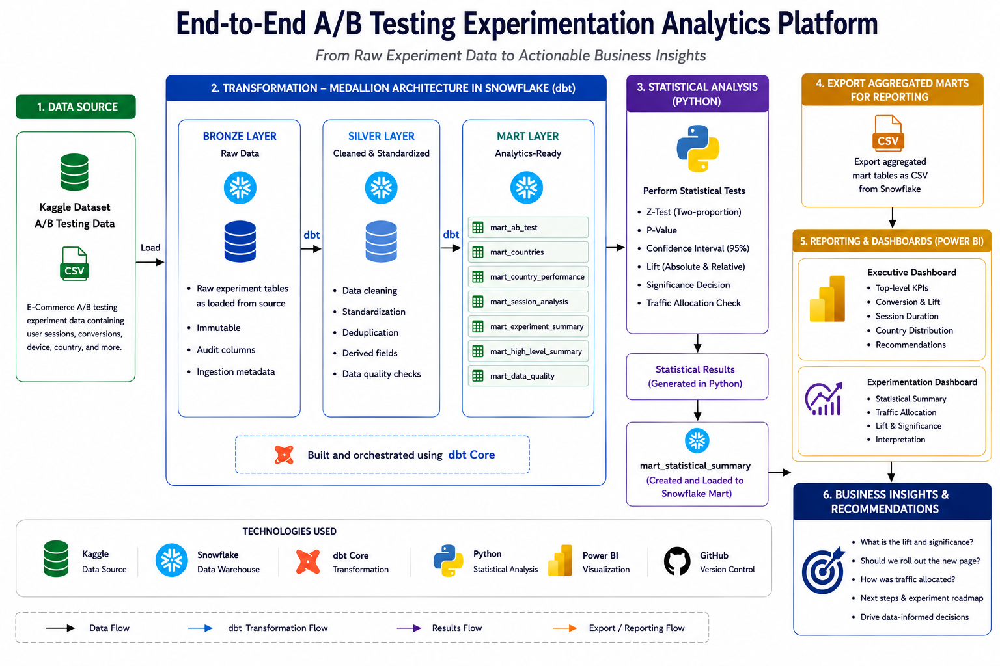
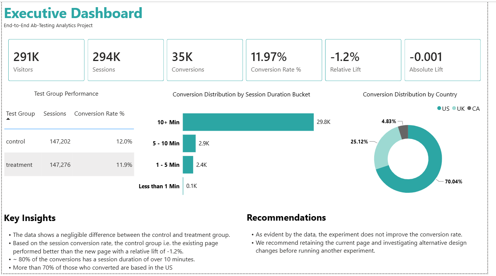
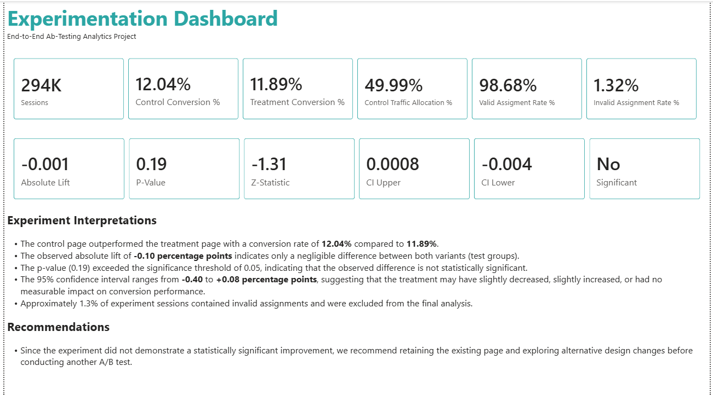

# End-to-End AB Testing Experimentation Analytics Platform

## 1. Problem Statement and Business Case
Companies frequently experiment with new product features and user experiences to improve key business outcomes such as customer acquisition, engagement, and conversion. However, making product decisions without a structured experimentation framework can lead to subjective conclusions and costly releases.

This project implements an end-to-end A/B Testing Analytics Engineering platform using a publicly available Kaggle dataset. The experiment compares an existing landing page (Control) with a redesigned landing page (Treatment) to evaluate whether the new experience improves user conversion.

The project demonstrates how raw experimental data can be transformed into trusted business metrics through an analytics engineering workflow. Data is modelled using **dbt**, transformed into analytics-ready marts, and visualized in **Power BI** to provide stakeholders with actionable insights.

## 2. Business Questions
The dashboards answers key business questions including:
- Does the new landing page improve conversion rates?
- What is the absolute and relative lift between the two variants?
- How was traffic allocated across the experiment?
- Were there any data quality issues that could affect the validity of the experiment?
- Based on the experimental results, should the new landing page be rolled out?

## 3. Project Objectives
- Build a production-style analytics engineering pipeline for A/B testing data.
- Transform raw experiment data into analytics-ready dimensional models using dbt.
- Calculate standardized A/B testing metrics, including conversion rate, traffic allocation, and experiment lift.
- Develop an executive Power BI dashboard that communicates experiment outcomes and business recommendations.
- Demonstrate analytics engineering best practices, including documentation, data quality validation, and reproducible transformations.

## 4. Project Highlights

- Built an end-to-end Analytics Engineering pipeline for A/B testing.
- Modelled experiment data using dbt dimensional models.
- Calculated statistical validation metrics including lift, z-statistic, p-value and confidence intervals.
- Developed executive and experimentation dashboards in Power BI.
- Produced business recommendations supported by statistical evidence.

## 5. Tech Stack

| Layer | Technology | Purpose |
|-------|------------|---------|
| Data Source | [E-Commerce A/B Testing Dataset (Kaggle)](https://www.kaggle.com/datasets/ahmedmohameddawoud/ecommerce-ab-testing) | Source experiment data |
| Data Warehouse | Snowflake | Central analytical data warehouse |
| Transformation | dbt Core | Analytics engineering and dimensional modelling |
| Version Control | Git & GitHub | Source code management |
| Visualization | Power BI | Executive dashboard and business reporting |

## 6. Solution Architecture




## 7. Analytics Engineer Workflow

1. Ingest the raw experiment data into Snowflake.
3. Transform the raw data into a medallion architecture (Bronze, Silver and Mart) using dbt.
4. Perform statistical analysis on the analytics-ready mart tables using Python.
5. Load the statistical analysis results back into the Snowflake mart schema.
6. Export the aggregated mart tables from Snowflake for reporting.
7. Build executive and experimentation dashboards in Power BI.
8. Generate business insights and recommendations based on the statistical results.

## 8. Data Model

This section of the document focuses **exclusively on the mart layer** of the data model. The project follows a medallion architecture namely
bronze, silver and the mart layer. A comprehensive description of the data model can be found in the [data dictionary documentation](documentation/01_data_dictionary.pdf).

| Table | Type | Grain | Approx. Rows | Purpose |
|-------|------------|---------|---------| ---------|
| mart_ab_test | Fact |One per user session | ~295k | Base fact table for experiment analysis |
| mart_countries | Mart | One record per user  | ~290k | User distribution by country | 
| mart_country_performance | Mart | One record per distinct registered country | 3 | Conversion metrics by country |
| mart_experiment_summary | Mart | One record per test group  | 2 | Executive A/B testing KPIs |
| mart_high_level_summary | Mart | One summary record | 1 | Overall experiment summary |
| mart_session_analysis | Mart | One record per duration bucket  | 4 | Session duration analysis |
| mart_data_quality | Mart | One summary data quality metrics records  | 1 | Data Quality Analysis |
| mart_statistical_summary | Mart | One statistical results summary record  | 1 | Statistical Summary |

---
## 9. BI Layer

This project uses Power BI as a visualisation layer however, Power BI is not connected to Snowflake to reduce unneccessary complexity.

The 8 mart tables are exported from snowflake in CSV format and loaded to Power BI. Additionally, only the pre-aggregated mart tables are
connected to at the BI Layer

## 10. Dashboard Review

### Executive Dashboard

**Purpose**: Provides executives with a high-level view of experiment performance and business impact.



**Highlights**
- Country-level and duration bucket conversion distribution
- Treatment vs. control comparison
- Relative and absolute lift

### Experimentation Dashboard

**Purpose**: Validates experiment integrity and statistical significance.



**Highlights**
- Traffic allocation
- Invalid assignment rate
- Z-statistic
- P-value
- Confidence interval

For detailed metrics definition, see [metrics_definition.md](documentation/03%20-%20metrics_definition.md)

---

## 11. Statistical Methodology

## 12. Key Findings

- The analysis shows a 1.3% invalid test group assignment error which was omitted from the overall analysis.
- The analysis shows a negligible difference between the control and treatment test groups conversion rates.
- Based on the results of the analysis, the control test group performed better than the treatment test group with a relative lift of -1.2%.
- Over 80% of the conversions had a session duration of over 10 minutes.

## 13. Business Recommendation

- We recommend rejecting the new page design and retaining the old page while exploring other design options that could has a concrete impact
on conversion.

## 14. Repository Structure

```text
AB-Testing/
│
├── README.md
├── LICENSE
├── requirements.txt
├── .gitignore
│
├── architecture/
│   └── architecture_diagram.png
│
├── dashboards/
│   ├── ab_testing_dashboard.pbix
│   ├── executive_dashboard.png
│   └── experimentation_dashboard.png
│
├── raw/
│   ├── ab_test.csv
│   └── countries_ab.csv
│
├── ab_testing/(dbt)
│   ├── models/
│   │       ├── bronze/
│   │       │    └── sources.yml
│   │       ├── silver/
│   │       │    ├── silver_ab_test.sql
│   │       │    ├── silver_countries.sql
│   │       │    ├── silver_data_quality.sql
│   │       │    └── silver_ab_users.sql
│   │       └── mart/
│   │       │    ├── mart_ab_test.sql
│   │       │    ├── mart_countries.sql
│   │       │    ├── mart_country_performance.sql
│   │       │    ├── mart_data_quality.sql
│   │       │    ├── mart_experiment_summary.sql
│   │       │    ├── mart_high_level_summary.sql
│   │       │    └── mart_session_analysis.sql
│   ├── tests/
│   ├── macros/
│   │       └── generate_schema_name.sql
│   ├── seeds/
│   └── dbt_project.yml
│
├── documentation/
│   ├── 01 - ab_testing_data_dictionary.pdf
│   ├── 02 - business_questions.md
│   └── 03 - metrics_definition.md
│
│
│
├── sql/
│   ├── ab_test.sql
│   ├── countries.sql
│   └── statistical_analysis.sql
│
└── src/
    ├── config/
    │       ├── envariables.py
    │       └── paths.py
    ├── load_csv.py
    ├── main.py
    └── statistical_analysis.py
```


## Key Skills Demonstrated

### Analytics Engineering

- dbt
- SQL
- Snowflake
- Dimensional Modelling

### Analytics

- A/B Testing
- Statistical Validation
- Product Analytics
- KPI Design

### BI

- Power BI
- Dashboard Design
- Executive Reporting

---

## Author
**Ajibola Komolafe** — Analytics Engineer | Data Analyst
- [LinkedIn](https://www.linkedin.com/in/ajibola-komo/) 
- [GitHub](https://github.com/ajibola-komo/)
- [Kaggle](https://www.kaggle.com/ajibsss)